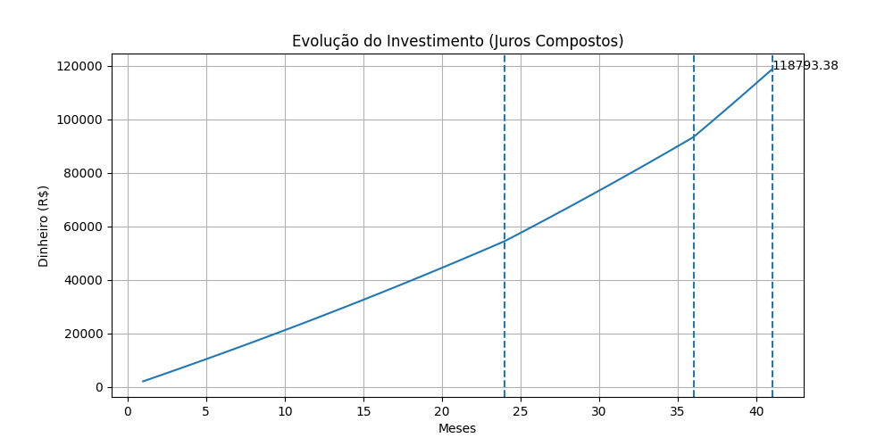

# 💰 Personal Finance Tracker

Um sistema em Python para controle financeiro pessoal com simulação de investimentos e visualização gráfica.

---

## 🚀 Funcionalidades

- Adicionar salário
- Registrar gastos
- Calcular saldo
- Simular investimentos com múltiplas etapas
- Persistência de dados em JSON
- Visualização gráfica com matplotlib:
  - Comparação (investido vs total final)
  - Evolução do investimento (juros compostos)

---

## 🧠 Conceitos aplicados

- Estruturas de dados (listas, dicionários)
- Modularização em Python
- Persistência com JSON
- Simulação de juros compostos
- Visualização de dados

---

## 📊 Exemplo de gráfico



---

## 🛠️ Tecnologias

- Python
- Matplotlib

---

## ▶️ Como executar

```bash
pip install -r requirements.txt
python main.py

## 🎯 Objetivo

Projeto desenvolvido com foco em prática de lógica, simulação financeira e preparação para estágio em desenvolvimento de software.